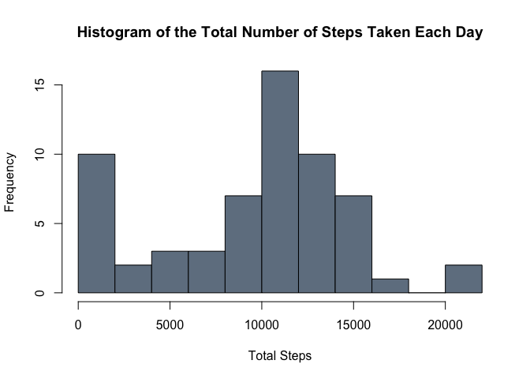
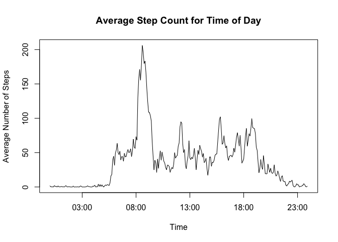
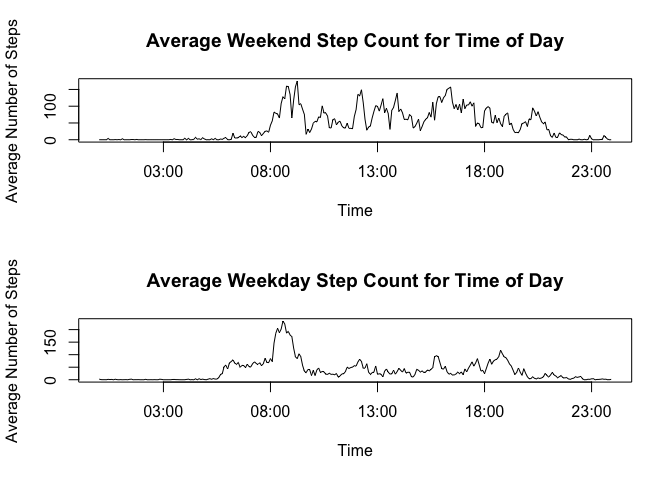

================================================================================

## --Note For Reviewers--

================================================================================

All assignment requirements have been embedded within the PA1_template.Rmd document. Links to the required figures and associated R code can be found below.

Links to the individual requirements:

[Loading and preprocessing the data](#loading-and-preprocessing-the-data)

[What is mean total number of steps taken per day?](#what-is-mean-total-number-of-steps-taken-per-day)

[What is the average daily activity pattern?](#what-is-the-average-daily-activity-pattern)

[Imputing missing values](#imputing-missing-values)

[Are there differences in activity patterns between weekdays and weekend?](#are-there-differences-in-activity-patterns-between-weekdays-and-weekends)


================================================================================


## Loading and preprocessing the data

1. Load the data (i.e. read.csv())


```r
## Load libraries used for data processing
library(tidyverse)
```

```
## ── Attaching packages ─────────────────────────────────────── tidyverse 1.3.0 ──
```

```
## ✓ ggplot2 3.3.3     ✓ purrr   0.3.4
## ✓ tibble  3.0.6     ✓ dplyr   1.0.4
## ✓ tidyr   1.1.2     ✓ stringr 1.4.0
## ✓ readr   1.4.0     ✓ forcats 0.5.1
```

```
## ── Conflicts ────────────────────────────────────────── tidyverse_conflicts() ──
## x dplyr::filter() masks stats::filter()
## x dplyr::lag()    masks stats::lag()
```

```r
library(lubridate)
```

```
## 
## Attaching package: 'lubridate'
```

```
## The following objects are masked from 'package:base':
## 
##     date, intersect, setdiff, union
```

```r
## Read data from CSV
step_data <- read.csv("./activity.csv")
```

2. Process/transform the data (if necessary) into a format suitable for your analysis


```r
step_data <- step_data %>%
    # Convert date from character into a date object
    mutate(date = ymd(date)) %>%
    # Create new time column with appropriate formatting from interval
    mutate(time = as.POSIXct(str_pad(interval, 4, "left", "0"), format="%H%M")) %>%
    # Select the steps and the modified date and time
    select(steps, date, time)
```

## What is mean total number of steps taken per day?

1. Calculate the total number of steps taken per day


```r
daily_steps <- step_data %>%
    # Group the data by the date ignoring the time
    group_by(date) %>%
    # Produce the sum of steps for each day
    summarize(total_steps = sum(steps, na.rm = TRUE))
```

2. Make a histogram of the total number of steps taken each day


```r
with(daily_steps, hist(total_steps, breaks = 10, xlab = "Total Steps",
                main = "Histogram of the Total Number of Steps Taken Each Day",
                col = "slategrey"))
```

<!-- -->

3. Calculate and report the mean and median of the total number of steps taken per day


```r
## Output the mean of the total number of steps
print(mean(daily_steps$total_steps))
```

```
## [1] 9354.23
```

```r
## Output the median of the total number of steps
print(median(daily_steps$total_steps))
```

```
## [1] 10395
```

## What is the average daily activity pattern?

1. Make a time series plot (i.e. type = "l") of the 5-minute interval (x-axis) and the average number of steps taken, averaged across all days (y-axis)


```r
daily_activity <- step_data %>%
    # Group the data by time (interval)
    group_by(time) %>%
    # Calculate the mean steps for that time (interval) over all days
    summarize(interval_step_average = mean(steps, na.rm = TRUE))

## Create the plot
with(daily_activity, plot(time, interval_step_average, type="l",
     main = "Average Step Count for Time of Day",
     xlab = "Time", ylab = "Average Number of Steps"))
```

<!-- -->

2. Which 5-minute interval, on average across all the days in the dataset, contains the maximum number of steps?


```r
print(paste("Interval with maximum number of steps on average:",
            as.character(daily_activity[daily_activity$interval_step_average ==
            max(daily_activity$interval_step_average), ]$time, "%H%M")))
```

```
## [1] "Interval with maximum number of steps on average: 0835"
```

## Imputing missing values

1. Calculate and report the total number of missing values in the dataset (i.e. the total number of rows with NAs)


```r
## Get the incomplete rows
incomplete_rows <- !complete.cases(step_data)
## Report count of incomplete rows
sum(incomplete_rows)
```

```
## [1] 2304
```

2. Devise a strategy for filling in all of the missing values in the dataset. The strategy does not need to be sophisticated. For example, you could use the mean/median for that day, or the mean for that 5-minute interval, etc.


```r
## Assume habitual behavior (e.g. walk to work on weekdays at 0800, or go to 
## gym every Wednesday morning). Impute NA value from average of other values 
## for same day and time. To do this we need to calculate the mean steps for the
## data grouped over the day of week and time (interval).
impute_values <- step_data %>%
    group_by(day_of_week = weekdays(date), time) %>%
    summarize(impute_value = mean(steps, na.rm = TRUE), .groups = "keep")
```

3. Create a new dataset that is equal to the original dataset but with the missing data filled in.


```r
step_data_imputed <- step_data %>%
    # Get the day of week for step_data
    mutate(day_of_week = weekdays(date)) %>%
    # Join with impute_values
    inner_join(impute_values, by = c("day_of_week" = "day_of_week",
                                     "time" = "time")) %>%
    # Update the steps value if it is NA
    mutate(steps = ifelse(is.na(steps), impute_value, steps)) %>%
    # Select out only the columns we want to keep
    select(steps, date, time)
```

4. Make a histogram of the total number of steps taken each day and Calculate and report the man and median total number of steps taken per day. Do these values differ from the estimates from the first part of the assignment? What is the impact of imputing missing data on the estimates of the total daily number of steps?


```r
daily_steps_imputed <- step_data_imputed %>%
    # Group the data by the date ignoring the time
    group_by(date) %>%
    # Produce the sum of steps for each day
    summarize(total_steps = sum(steps, na.rm = TRUE))

## Produce side by side histograms to show difference before and after imputation
par(mfrow=c(1,2))
with(daily_steps, hist(total_steps, breaks = 10, xlab = "Total Steps",
                main = "Daily Total Steps (Original)",
                col = "slategrey"))
with(daily_steps_imputed, hist(total_steps, breaks = 10, xlab = "Total Steps",
                main = "Daily Total Steps (with Imputation)",
                col = "slategrey"))
```

<!-- -->

```r
## Output the mean of the total number of steps
print(paste("Mean Daily Steps (Original):", mean(daily_steps$total_steps)))
```

```
## [1] "Mean Daily Steps (Original): 9354.22950819672"
```

```r
print(paste("Mean Daily Steps (with Imputation): ",
            mean(daily_steps_imputed$total_steps)))
```

```
## [1] "Mean Daily Steps (with Imputation):  10821.2096018735"
```

```r
## Output the median of the total number of steps
print(paste("Median Daily Steps (Original):", median(daily_steps$total_steps)))
```

```
## [1] "Median Daily Steps (Original): 10395"
```

```r
print(paste("Median Daily Steps (with Imputation): ", 
            median(daily_steps_imputed$total_steps)))
```

```
## [1] "Median Daily Steps (with Imputation):  11015"
```

## Are there differences in activity patterns between weekdays and weekends?

1. Create a new factor variable in the dataset with two levels - "weekday" and "weekend" indicating whether a given date ifs a weekday or weekend day.


```r
step_data <- step_data %>%
    # Create daytype factor variable indicating weekday/weekend
    mutate(daytype = factor(ifelse(weekdays(date) %in% c("Saturday", "Sunday"), 
                           "weekend", "weekday"))) %>%
    # Select out the steps, time (interval), and new daytype column
    select(steps, time, daytype)
```

2. Make a panel plot containing a time series plot (i.e. type = "l") of the 5-minute interval (x-axis) and the average number of steps taken, averaged across all weekday days or weekend days (y-axis). 


```r
weekday_activity <- step_data %>%
    # Filter to only weekdays
    filter(daytype == "weekday") %>%
    # Group the data by time (interval)
    group_by(time) %>%
    # Calculate the mean steps for that time (interval) over weekdays
    summarize(interval_step_average = mean(steps, na.rm = TRUE))

weekend_activity <- step_data %>%
    # Filter to only weekdays
    filter(daytype == "weekend") %>%
    # Group the data by time (interval)
    group_by(time) %>%
    # Calculate the mean steps for that time (interval) over weekends
    summarize(interval_step_average = mean(steps, na.rm = TRUE))

## Create the plots
par(mfrow=c(2,1))
with(weekend_activity, plot(time, interval_step_average, type="l",
     main = "Average Weekend Step Count for Time of Day",
     xlab = "Time", ylab = "Average Number of Steps"))
with(weekday_activity, plot(time, interval_step_average, type="l",
     main = "Average Weekday Step Count for Time of Day",
     xlab = "Time", ylab = "Average Number of Steps"))
```

<!-- -->
